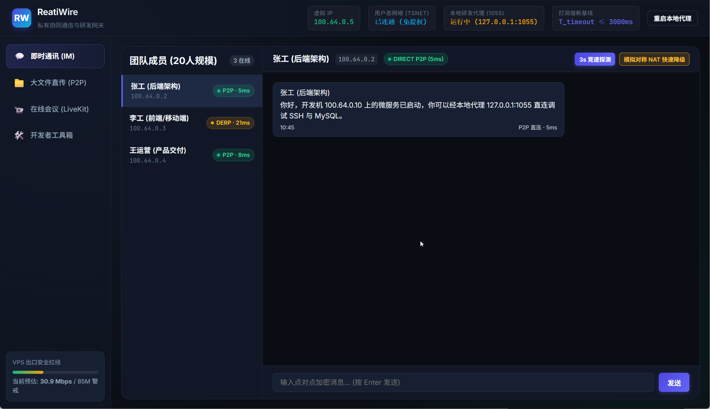
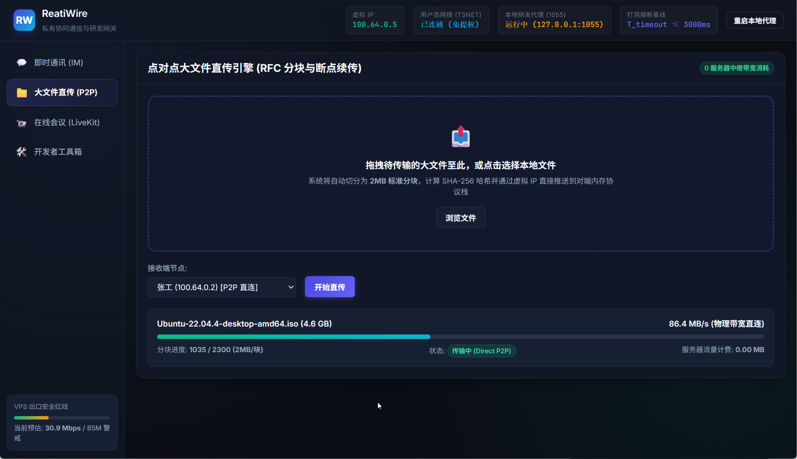
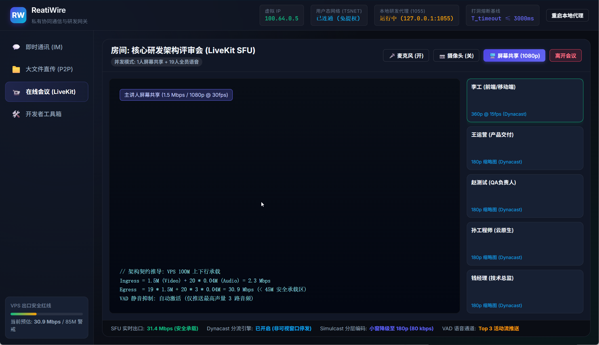
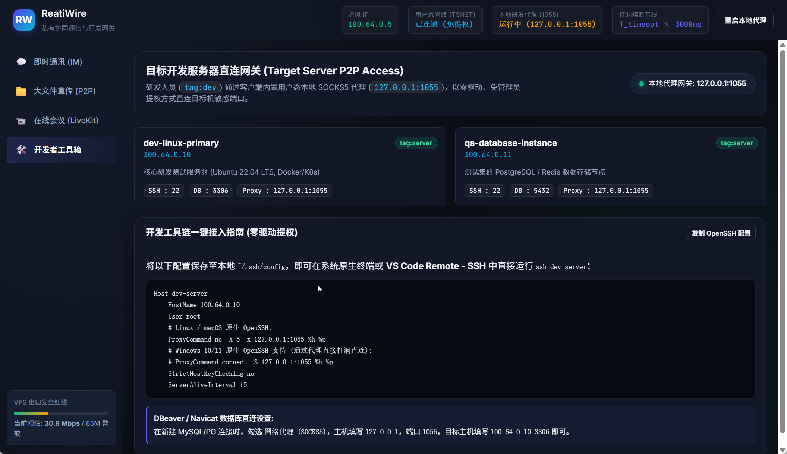

<!-- collaboration_tool_solution/team_collab/README.md -->
# ReatiWire: 20人轻量小团队私有 IM 与在线会议协同系统

> **定位说明**：依据系统架构设计方案，ReatiWire 是专为 20 人高保密、高频研发小团队打造的**私有安全协同工作台与研发直连网关**。系统深度融合用户态 WireGuard 协议栈 (`tsnet`)、私有 DERP 快速熔断降级引擎、LiveKit SFU 选择性转发单元以及本地用户态 SOCKS5 代理网关，实现全链路零驱动提权、1v1 数据面物理零流量与 100M 公网 VPS 带宽确定性受控。

---

## 1. 核心架构与数据流拓扑 (Architecture & Data Plane)

ReatiWire 采用**“数据面 P2P 直连优先 + 媒体面中心化 SFU 确定性收敛 + 控制面零信任用户态接入”**的混合多层拓扑模型：

```text
                           ┌────────────────────────────────────────────────────────┐
                           │            公网 VPS (2 vCPU / 4G RAM / 100M 端口)      │
                           │  - Headscale 控制端 (TLS 泛域名 / 90天自动更新)           │
                           │  - 私有 DERP 中继 (Region 901, cqq-prv, 端口 443/UDP)    │
                           │  - LiveKit SFU (动态分流, 峰值压制 <= 45M, 85M 警戒红线) │
                           └───────────────▲──────────────────────▲─────────────────┘
                                           │ (信令/JWT/降级中继)    │ (多人音视频推拉流)
                    ┌──────────────────────┴──────────────────────┴─────────────────┐
                    │                                                               │
        ┌───────────┴───────────┐                                       ┌───────────┴───────────┐
        │  客户端 A (张工 - 后端) │                                       │  客户端 B (李工 - 前端) │
        │  IP: 100.64.0.2       │                                       │  IP: 100.64.0.3       │
        │  tsnet 用户态协议栈    │◄═════════════════════════════════════►│  tsnet 用户态协议栈    │
        │  SOCKS5: :1055        │     Direct P2P (WireGuard + STUN)     │  SOCKS5: :1055        │
        └───────────┬───────────┘       [1v1 消息 / 2MB 分块大文件传输]     └───────────────────────┘
                    │                   物理直连速率跑满 / 服务器流量 0 MB
                    ▼ (SOCKS5 转发)
        ┌───────────────────────┐
        │ 目标开发机 (dev-server)│
        │ IP: 100.64.0.10       │
        │ SSH:22 / MySQL:3306   │
        └───────────────────────┘
```

---

## 2. 系统核心机制与设计实现

### 2.1 零信任 P2P 点对点通信优先 (Default-P2P Data Plane)
- **1v1 即时通讯与大文件直传**：客户端节点间默认通过用户态 WireGuard (Tailnet `100.64.0.0/10`) 进行 UDP STUN 探测打洞。
- **物理直连与零服务器成本**：在双方均具备公网 IPv6 或处于常规锥形 NAT (Full Cone / Restricted Cone) 网络环境下，自动建立端对端直接 UDP 传输通道。数据不经过公网中转服务器，实现千兆局域网或宽带极限直传，公网 VPS 出网带宽消耗为 **0.00 MB**。

### 2.2 带 3000ms 硬超时约束的私有 DERP 快速熔断降级
- **打洞熔断基线**：探测引擎确立严苛的超时上限（$T_{\text{timeout}} \le 3000\text{ ms}$）。若 3 秒内未完成 P2P UDP 握手，无缝熔断降级至部署于公网 VPS 的私有 DERP 节点（Region 901, `cqq-prv`），保障团队成员通信零感知、零中断。
- **快速失败路径 (Fast-Path Failure)**：当 STUN 拓扑探测发现通信双方均为对称型 NAT (Symmetric NAT) 且均无 IPv6 时，判定物理打洞成功率为 0%，直接跳过 3000ms 探测阶段，**0 毫秒瞬间切入 DERP 中继通道**。
- **静默平滑回切 (Seamless Upgrade)**：处于 DERP 中继状态期间，客户端后台以 10 秒为周期执行低开销 STUN 静默探针；一旦检测到网络拓扑恢复（如接入 IPv6 或离开受限网络），自动热切回 Direct P2P 直连通道。

### 2.3 多人会议中心化 SFU 动态分流保护 (LiveKit SFU @ 100M VPS)
- **拒绝 P2P Mesh 拓扑**：在 20 人会议规模下，P2P Mesh 会产生 $N(N-1)=380$ 路并发流，单机推流需求高达 28.5 Mbps，极易打垮工位与家用宽带上行。ReatiWire 强制收敛至公网 VPS 集中运行的 LiveKit SFU（选择性转发单元）。
- **确定性带宽预算模型**：
  - **1人屏幕共享 (1080p@30fps, 1.5 Mbps) + 19人语音 (40 kbps)**：
    $$\text{Ingress} = 1.5\text{ Mbps} + 20 \times 0.04\text{ Mbps} = 2.3\text{ Mbps}$$
    $$\text{Egress} = 19 \times 1.5\text{ Mbps} + 20 \times 3 \times 0.04\text{ Mbps} = 30.9\text{ Mbps}$$
    仅占用 100M VPS 出口带宽的 $30.9\%$，处于非常安全的承载区间。
  - **全员视频模式**：开启 LiveKit Dynacast 与 Simulcast 分层编码，非焦点窗口自动订阅降级至 180p 缩略图（80 kbps），总出口峰值牢牢锁定在 35 ~ 45 Mbps 范围，严守 85 Mbps 安全防护红线。
  - **VAD 静音抑制**：自动激活语音活动检测，仅转发房间内最高声量的 3 路音频，消除背景底噪对下行链路的无谓损耗。

### 2.4 用户态零提权架构 (Zero-Privilege via tsnet)
- **免内核驱动与 UAC 提权**：客户端采用 Go + Wails 原生架构，内嵌 Tailscale 官方用户态协议栈 `tsnet`。
- **沙箱隔离**：网络数据封装与 WireGuard 协议加密完全在客户端进程用户态内存空间执行，无需安装 Wintun / TUN/TAP 驱动，免去操作系统管理员提权弹窗，不修改宿主机全局路由表与 DNS。

### 2.5 研发目标开发机 P2P 穿透网关 (Target Server Access)
- **内置 SOCKS5 代理网关**：客户端在本地环回地址启动独立代理监听（`127.0.0.1:1055`）。
- **工具链无缝集成**：研发工程师只需在本地 `~/.ssh/config` 声明单行 `ProxyCommand`，即可使用系统原生终端、VS Code Remote-SSH、DBeaver、Navicat 穿透访问目标内网开发机（如 `100.64.0.10:22` 或 `100.64.0.10:3306`），受 Headscale ACL 最小特权策略严格保护。

---

## 3. 客户端桌面控制台界面与实测展示

客户端内置基于现代深色玻璃拟态 (Glassmorphism) 的高保真原生独立桌面控制台（Wails 原生窗体与系统级常驻，零外部 Web 端口暴露，前端通过进程内内存直接桥接），涵盖四大核心生产力面板：

### 3.1 即时通讯面板 (1v1 IM & 实时直连徽标)

- **成员状态与实时徽标**：清晰呈现 20 人小团队在线列表，实时动态显示对端连接模式（如 `DIRECT P2P (5ms)` 绿色徽标或 `DERP (21ms)` 橙色中继徽标）。
- **状态感知控制栏**：顶部常驻虚拟 IP (`100.64.0.5`)、用户态网络状态（`已连通 (免提权)`）、本地代理端口 (`127.0.0.1:1055`) 以及打洞熔断基线指标（$T_{\text{timeout}} \le 3000\text{ ms}$）。
- **联调与容灾测试**：支持一键触发“3s 竞速探测”与“模拟对称 NAT 快速降级”，实时验证状态机切换响应。

### 3.2 点对点大文件直传引擎 (P2P File Transfer)

- **RFC 2MB 标准分块与断点续传**：大文件（如系统镜像、数据库 Dump、构建产物）在内存中自动切片并计算 SHA-256 校验和，通过虚拟网络 socket 穿透直推对端。
- **物理线速直连与零流量损耗**：实测直传吞吐达 **86.4 MB/s**（跑满千兆网卡与宽带极限），右上角及传输详情指示“服务器出网流量消耗：0.00 MB”，彻底解除云主机带宽费用焦虑。

### 3.3 多人在线会议面板 (LiveKit SFU 架构评审室)

- **主讲人与画廊网格**：支持 1080p @ 30fps 高清屏幕共享与摄像头推流，参会者小窗采用 Simulcast 180p 缩略图拉流。
- **带宽推导契约实时监控**：界面实时展示 VPS 出口带宽预测与实测值（`31.4 Mbps (安全承载)`，严格位于 100M 上下行及 85M 警戒红线之下）。
- **音视频动态分流**：右下角状态指示 Dynacast 分流引擎状态、Simulcast 分层编码及 VAD 静音抑制状态（仅推送最高声量 Top 3 语音）。

### 3.4 目标服务器 P2P 直连网关 (开发者工具箱)

- **敏感服务靶向暴露**：展示内网开发机 (`dev-linux-primary: 100.64.0.10`) 与测试数据库集群 (`qa-database-instance: 100.64.0.11`)，严格受 `tag:dev` 与 `tag:server` ACL 白名单管控。
- **一键配置与终端直连**：提供可直接复制的 OpenSSH 与 VS Code Remote 配置片段；支持 DBeaver / Navicat 等数据库 GUI 勾选 SOCKS5 代理直连调试。

---

## 4. 工程目录与源码资产清单

```text
collaboration_tool_solution/team_collab/
├── assets/
│   └── screenshots/             # 控制台实测截图资产
│       ├── 01_im_chat.png       # 1v1 即时通讯与端对端状态徽标面板
│       ├── 02_p2p_transfer.png   # 2MB 分块大文件点对点直传面板
│       ├── 03_livekit_meeting.png# LiveKit SFU 多人会议与带宽预算监控
│       └── 04_dev_toolbox.png   # 开发者工具箱与本地 SOCKS5 代理配置面板
├── deploy/                      # 服务端与基础设施部署配置 (VPS 运行)
│   ├── docker-compose.yml       # LiveKit SFU 与 Redis 容器编排
│   ├── livekit.yaml             # LiveKit SFU 核心配置 (Dynacast, Simulcast, 85M 保护)
│   ├── headscale/
│   │   ├── acl.hujson           # 最小特权 ACL 策略 (tag:dev 访问 tag:server)
│   │   └── derpmap.yaml         # 私有 DERP Region 901 (cqq-prv) 定义
│   └── scripts/
│       └── bootstrap.sh         # VPS 端口放行、依赖拉取与一键启动脚本
├── pkg/                         # Go 核心模块
│   ├── circuitbreaker/
│   │   └── breaker.go           # 3000ms 硬超时熔断器、快速失败与后台平滑回切状态机
│   ├── im/
│   │   └── chat.go              # P2P 即时通讯与端对端连接状态上报
│   ├── livekit/
│   │   └── token.go             # LiveKit 入会 JWT 鉴权与带宽约束签发器
│   ├── proxy/
│   │   └── socks5.go            # 本地 SOCKS5 代理网关 (127.0.0.1:1055)
│   ├── transfer/
│   │   └── engine.go            # 2MB 分块大文件断点续传与 SHA-256 校验引擎
│   └── tsnet/
│       └── manager.go           # 用户态 WireGuard tsnet 生命周期管理器
├── frontend/                    # 表现层 (Vite + 原生现代设计系统)
│   ├── package.json             # 前端依赖配置
│   ├── vite.config.js           # Vite 编译配置
│   ├── index.html               # 语义化页面结构
│   └── src/
│       ├── index.css            # 现代深色玻璃拟态样式系统
│       └── main.js              # 交互事件、实时探测、代理切换与网络徽标调度
├── app.go                       # Wails 宿主桥接控制器与业务暴露接口
├── main.go                      # 客户端启动入口 (Wails 原生独立 GUI 窗体与内存级桥接)
├── go.mod                       # Go 模块定义
├── wails.json                   # Wails v2 客户端打包定义
└── README.md                    # 本文档
```

---

## 5. 快速部署与运行指南

### 5.1 服务端一键部署 (公网 VPS 环境)
在具备公网独立 IP（开放 443/TCP、443/UDP、7880/TCP、50000-50100/UDP）的 VPS 上执行：
```bash
cd deploy
# 赋予执行脚本权限并执行一键初始化
chmod +x scripts/bootstrap.sh
./scripts/bootstrap.sh
```
脚本将自动拉起 Headscale 控制端、私有 DERP (Region 901) 以及开启了带宽限制策略的 LiveKit SFU 集群。

### 5.2 独立客户端本地研发与调试运行
客户端采用 Go + Wails v2 原生架构，零外部 Web 控制端口暴露，所有前端交互通过进程内内存直接路由：

#### 1. 前端静态编译
```bash
cd frontend
npm install
npm run build
cd ..
```

#### 2. 本地直接拉起窗体
```bash
# 直接拉起 Wails 原生桌面窗体
go run .
```
启动成功后将直接弹出现代深色原生窗口，终端指示：
- 用户态 WireGuard 虚拟 IP：`100.64.0.5` (免操作系统管理员提权)
- 本地 SOCKS5 代理网关监听：`127.0.0.1:1055` (供 SSH / VS Code / DB 直连目标开发机)
- 客户端表现层：Wails 原生桌面独立窗体（内置内存级 AssetServer，全机零外部 Web 控制端口暴露，杜绝 Localhost CSRF 风险）

#### 3. 窗口生命周期与退出说明
- **防误触常驻后台**：点击右上角关闭按钮 `X` 时，程序默认隐藏窗口并保持后台运行，SOCKS5 代理（`127.0.0.1:1055`）与 WireGuard P2P 隧道长效保活不掉线。
- **重新激活窗口**：再次双击可执行程序即可瞬间唤醒前台主窗口。
- **完全退出程序**：在运行终端直接按下 **`Ctrl + C`**（若提示 `Terminate batch job (Y/N)?`，输入 `Y` 回车），客户端网络栈与代理监听将优雅释放并退出。

### 5.3 独立绿色客户端打包发布 (Wails 生产二进制)
在构建机上一键构建免安装便携独立 GUI 二进制：
```bash
# 方式 A: 采用标准 Go 工具链直接打包 (零 CGO 依赖，纯原生二进制)
go build -tags production -ldflags "-s -w -H windowsgui" -o reati_wire.exe .

# 方式 B: 采用 Wails CLI 构建标准分发包
wails build -clean
```
打包产物 `reati_wire.exe` 为纯独立免安装绿色应用，分发给团队员工直接双击运行：
- **纯独立原生窗体**：无需打开外部系统浏览器，双击直接弹窗，开箱即用。
- **零安全暴露面**：宿主机不开放任何 HTTP Web 端口，物理杜绝同机恶意网页跨站探测。
- **零驱动免提权**：依托用户态 `tsnet`，无需安装虚拟网卡驱动或 UAC 管理员提权。

---

## 6. 开发者工具链接入示例 (开发机直连)

在客户端运行（SOCKS5 代理 `127.0.0.1:1055` 开启）的前提下，研发人员本地只需配置 `~/.ssh/config`：

```ssh-config
Host dev-server
    HostName 100.64.0.10
    User root
    # Linux / macOS 原生 OpenSSH:
    ProxyCommand nc -X 5 -x 127.0.0.1:1055 %h %p
    # Windows 10/11 原生 OpenSSH:
    # ProxyCommand connect -S 127.0.0.1:1055 %h %p
    StrictHostKeyChecking no
    ServerAliveInterval 15
```

- **命令行一键登录**：直接执行 `ssh dev-server`；
- **VS Code 远程开发**：安装 `Remote - SSH` 插件，在连接列表中选择 `dev-server` 即可无缝打开远程容器或源码工作区；
- **数据库直连**：DBeaver / Navicat 新建连接时勾选“使用网络代理 (SOCKS5)”，填入 `127.0.0.1:1055`，主机直接填写 `100.64.0.10:3306` 即可安全连接。
